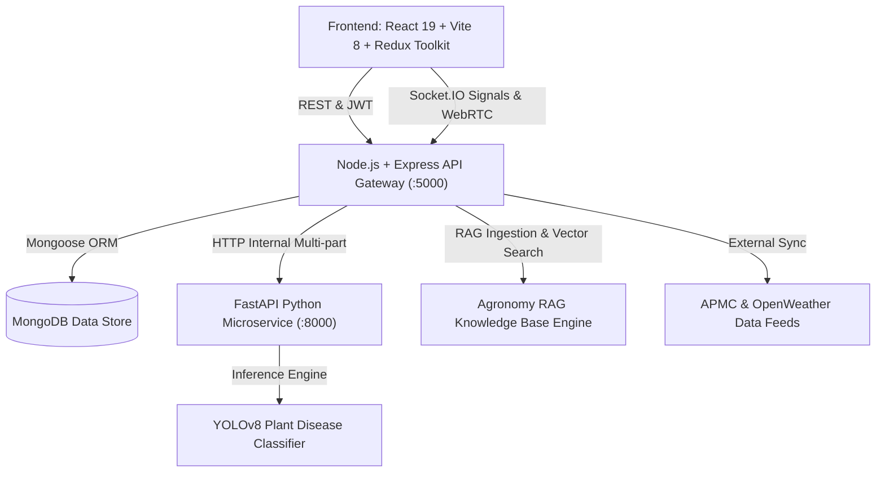

# 🏗️ Farm Fusion 2.0 System Architecture

## Overview
Farm Fusion 2.0 is designed as a distributed, decoupled agricultural decision-support ecosystem connecting three primary user personas: **Farmers**, **Students**, and **Certified Agricultural Experts**.

## Core Subsystems
1. **AI Farmer Profile & Soil Passport**: Stores soil chemistry (N, P, K, pH), micro-climate, water sources, livestock count, and financial parameters.
2. **Crop Intelligence Engine**: Evaluates agronomic suitability using decision-tree weighting, paired with an economic crop profit and break-even calculator.
3. **Grounded RAG Farmer Copilot**: Multi-turn conversational assistant injecting farm context into ICAR/KVK-verified agricultural literature.
4. **8-Stage Farm Lifecycle Navigator**: Step-by-step guidance across `PLAN` → `PREPARE` → `PLANT` → `GROW` → `MONITOR` → `HARVEST` → `SELL` → `ANALYZE`.
5. **Computer Vision Disease Scanner**: YOLOv8 visual classifier mapped with dual-stage organic and chemical management protocols.
6. **Farmer ↔ Student ↔ Expert Tripartite Hub**: Crowdsourced field problem resolution where students propose academic analyses and certified scientists provide official validation.
